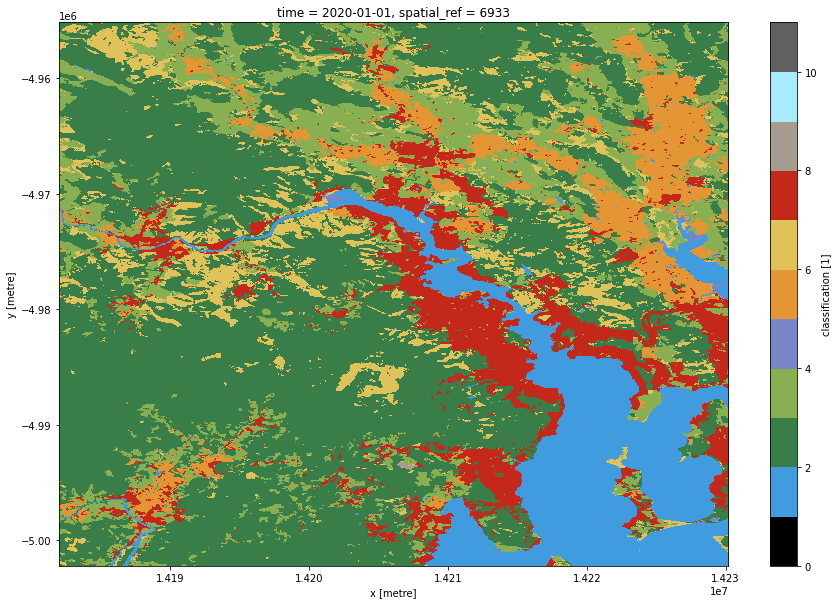

# Indexing ESRI Land Cover

ESRI Land Cover data is available from a public bucket, although it's not
publically queryable. The data is documented [here](https://livingatlas.arcgis.com/landcover/)
and [here](https://www.arcgis.com/home/item.html?id=d6642f8a4f6d4685a24ae2dc0c73d4ac).

We've created a [list of the available tiles here](https://github.com/opendatacube/odc-tools/blob/develop/apps/dc_tools/odc/apps/dc_tools/esri-lc-tiles-list.txt).

There is a script to index the data, which is described below.

An [ODC product definition for ESRI Land Cover data](products/esri_land_cover.yaml) is inluded in this repo.
You can this to datacube using the following command, but the indexing tool will do this automatically for you:

```bash
datacube product add products/esri_land_cover.yaml
```

## Installing the required tools

Install the scripts required by [following the instructions here](https://github.com/opendatacube/odc-tools/tree/develop/apps/dc_tools) like this:

```bash
pip install --extra-index-url="https://packages.dea.ga.gov.au" odc_apps_dc_tools
```

## Indexing the data

To index all 700 scenes, you can run the command below. Excluded the `--add-product` if you
already added the product in the previous step.

```bash
esri-lc-to-dc --add-product
```

## Plotting example

To plot the data, you can use this code to set up the same colour ramp as ESRI use:

```python
import datacube

from matplotlib import colors as mcolours
import numpy as np

dc = datacube.Datacube()

product = "esri_land_cover"
# This is a point in Hobart
lat, lon = -42.822771, 147.234277
buf = 0.25
lons = (lon - buf, lon + buf)
lats = (lat - buf, lat + buf)

# Load the data at 10 m resolution
ds = dc.load(
    product=product,
    longitude=lons,
    latitude=lats,
    resolution=(-10, 10),
    output_crs="epsg:6933"
)

# Colour it like the ESRI colour map
cmap = mcolours.ListedColormap([
      np.array([0, 0, 0]) / 255,
      np.array([65, 155, 223]) / 255,
      np.array([57, 125, 73]) / 255,
      np.array([136, 176, 83]) / 255,
      np.array([122, 135, 198]) / 255,
      np.array([228, 150, 53]) / 255,
      np.array([223, 195, 90]) / 255,
      np.array([196 ,40, 27]) / 255,
      np.array([165, 155, 143]) / 255,
      np.array([168, 235, 255]) / 255,
      np.array([97, 97, 97]) / 255
])
bounds=range(0,12)
norm = mcolours.BoundaryNorm(np.array(bounds), cmap.N)
ds.isel(time=0).classification.plot.imshow(cmap=cmap, norm=norm, size=10)
```


